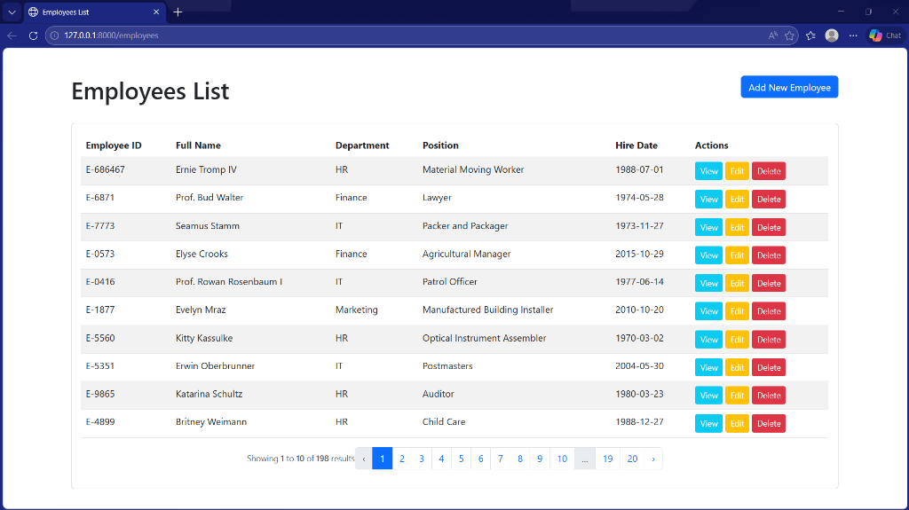
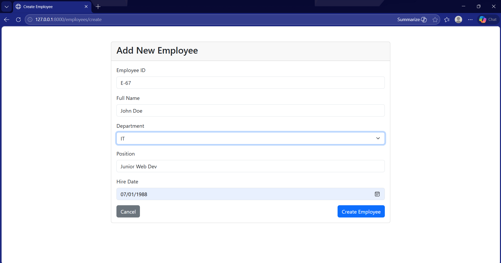
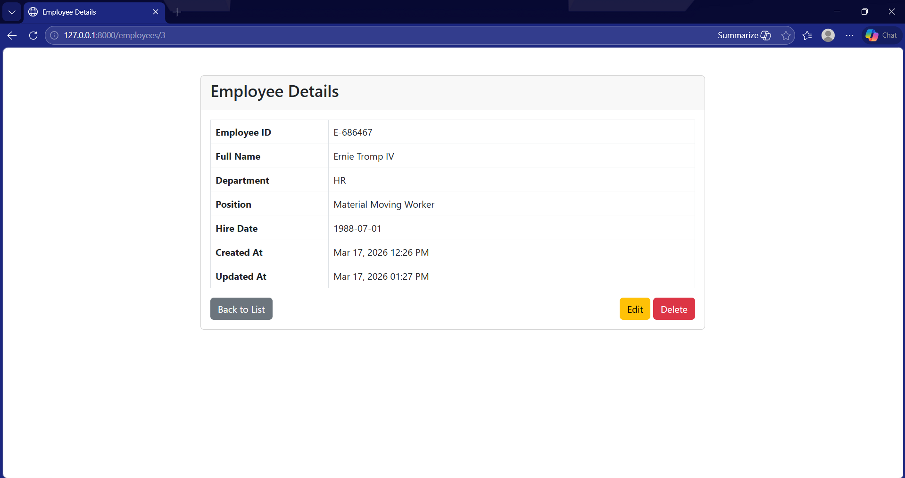
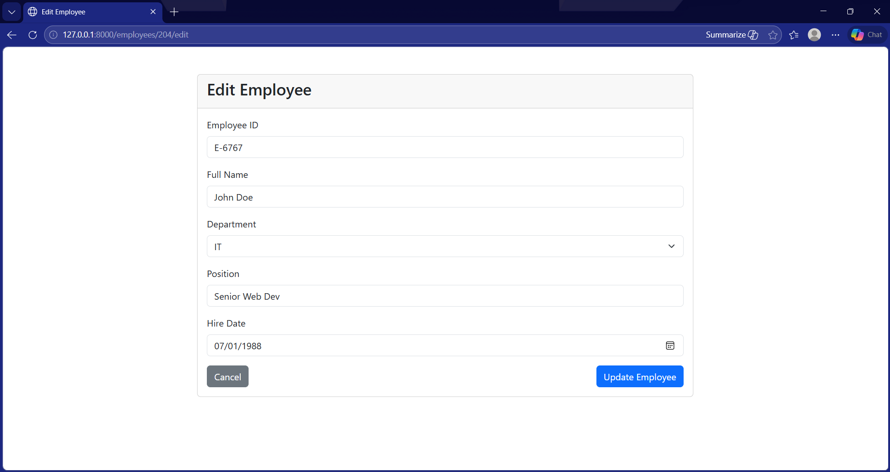
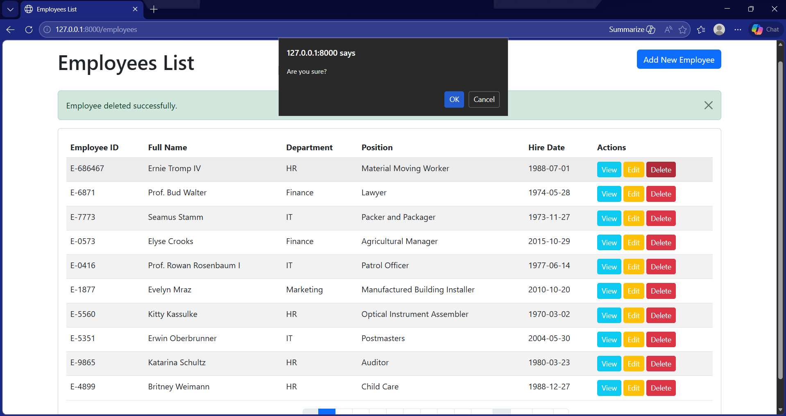
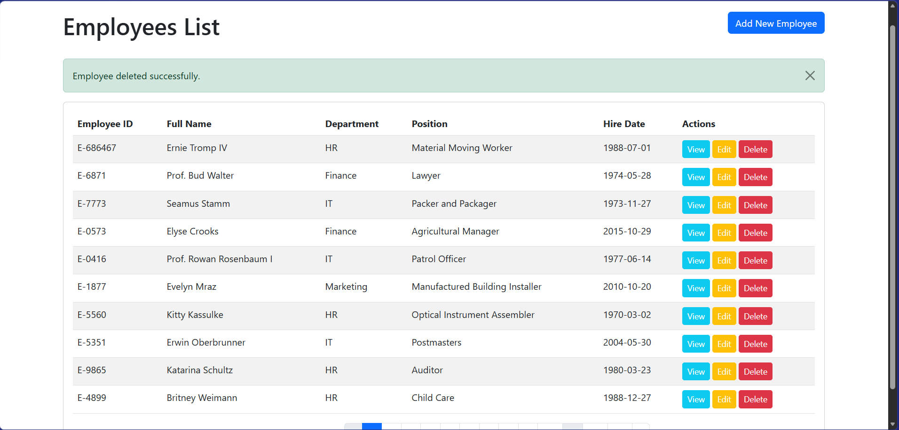

# Employee Management System

This project is a conversion of the Student Management CRUD system into an Employee Management system.

## Project Details
- **Management System Name:** Employee Management System
- **Entity:** Employee

## Database Table Fields
The `employees` table contains the following fields:
- `id`: Primary Key (Auto-increment)
- `employee_id`: Unique identifier for the employee (e.g., E-0001)
- `full_name`: The full name of the employee
- `department`: The department the employee belongs to (Enum: IT, HR, Sales, Marketing, Finance)
- `position`: The job title/position of the employee
- `hire_date`: The date the employee was hired
- `created_at`: Timestamp for record creation
- `updated_at`: Timestamp for last record update

## Features
- **Create:** Add new employee records with validation.
- **Read:** List all employees with pagination and view individual employee details.
- **Update:** Modify existing employee information.
- **Delete:** Remove employee records from the system.

## Setup Instructions
1. Clone the repository.
2. Run `composer install`.
3. Configure your `.env` file (default uses SQLite).
4. Run `php artisan migrate:fresh --seed` to set up the database and sample data.
5. Access the application at `http://localhost:8000/`.

## Screenshots
**Dashboard**

## CRUD Operations
**Create**

**Read**

**Update**

**Delete**

